# AWS VPC Networking Project (CLI)

## Overview

This hands-on AWS networking project was built entirely using the AWS CLI to strengthen my understanding of core VPC architecture, routing, security, and multi-VPC connectivity.

I started by building a custom VPC from scratch, then layered in subnets, an ENI, an Internet Gateway, route table updates, security groups, a custom NACL, Elastic IP association, and finally a Transit Gateway to connect two VPCs.

The goal wasn’t just to run commands, but to actually understand how each component fits together and verify everything step-by-step along the way.

---

## What This Covers

- Creating a VPC and subnets across multiple AZs  
- Attaching and configuring an Internet Gateway  
- Working with route tables  
- Configuring Security Groups and NACLs  
- Allocating and associating an Elastic IP  
- Building and verifying Transit Gateway routing  
- Testing connectivity between VPCs  

---

## Environment

- AWS CLI (configured locally)
- Windows PowerShell
- Region: `us-east-1`

---

## Build Process

### 1. Create VPC

Created the primary VPC and confirmed CIDR block assignment.

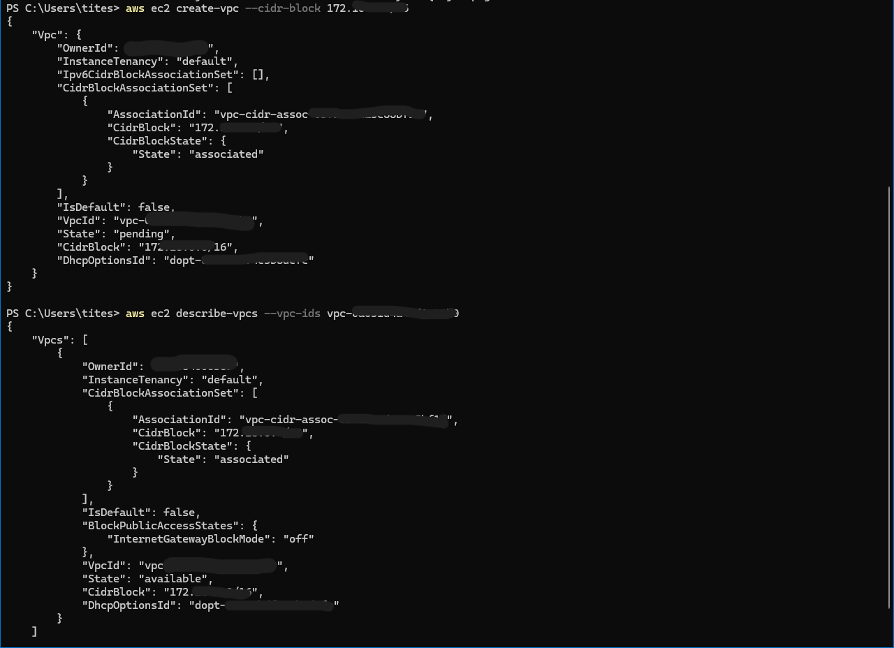

---

### 2. Create Subnets

Provisioned subnets in separate availability zones.

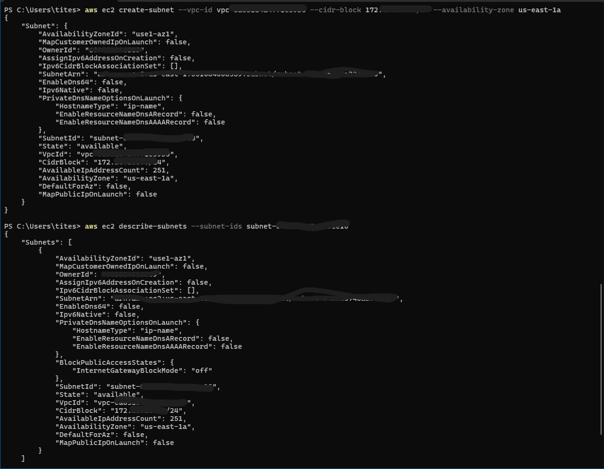  
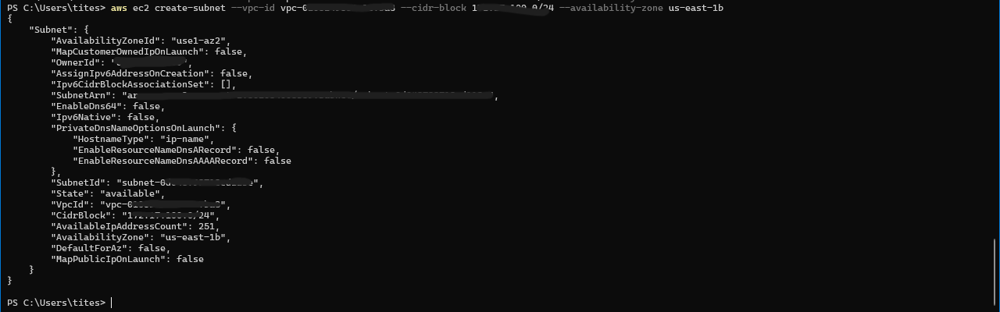

---

### 3. Create Network Interface

Created and verified ENI attachment within the subnet.

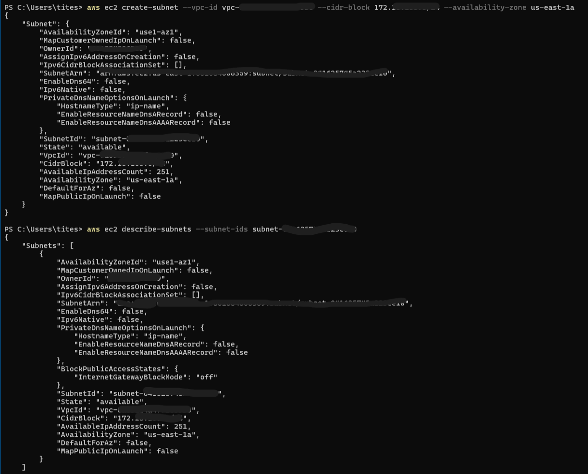

---

### 4. Attach Internet Gateway

Attached IGW to enable outbound internet access.

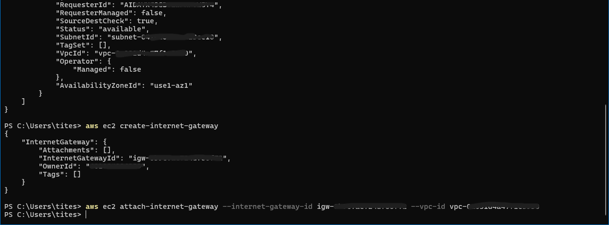

---

### 5. Review Route Table (Pre-IGW)

Verified default route table before adding internet access.

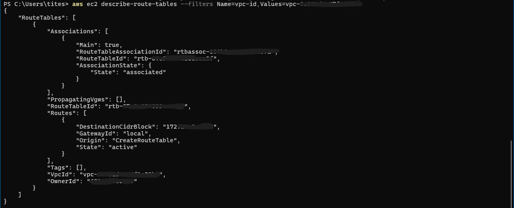

---

### 6. Add Default Route to IGW

Configured outbound route (`0.0.0.0/0`) through IGW.

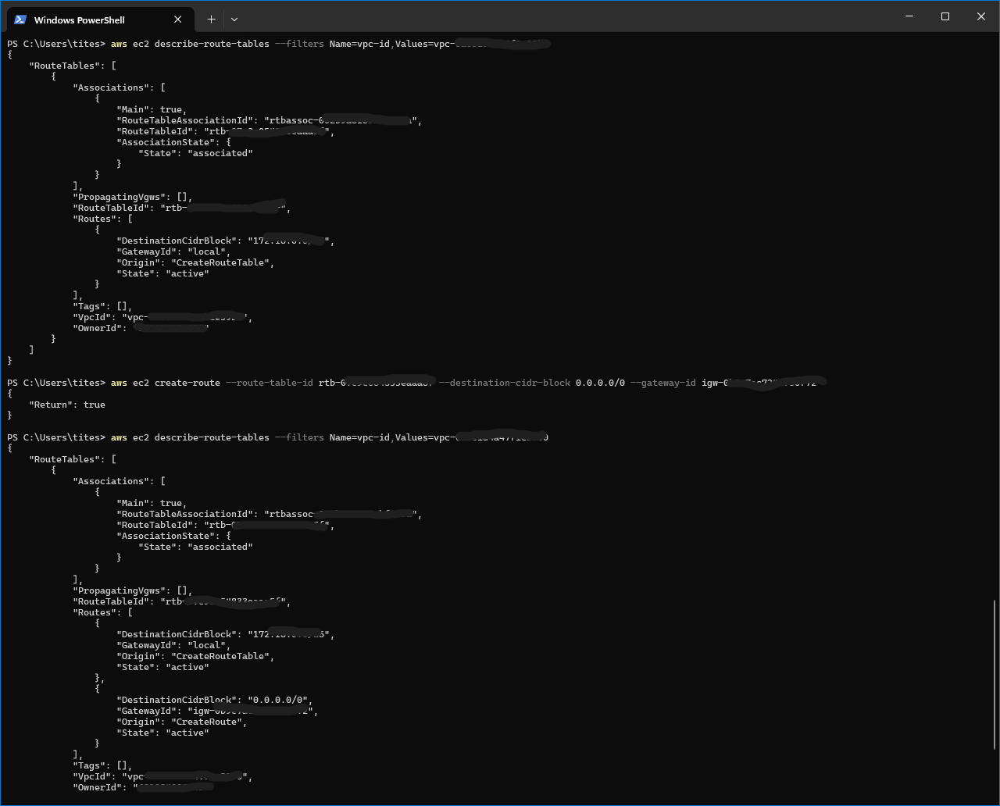

---

### 7. Configure Security Group

Allowed inbound HTTP / HTTPS / SSH traffic.

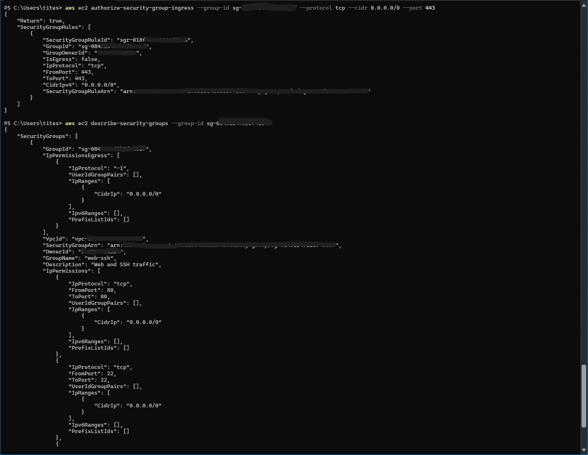

---

### 8. Configure Network ACL

Created NACL and applied SSH rule.

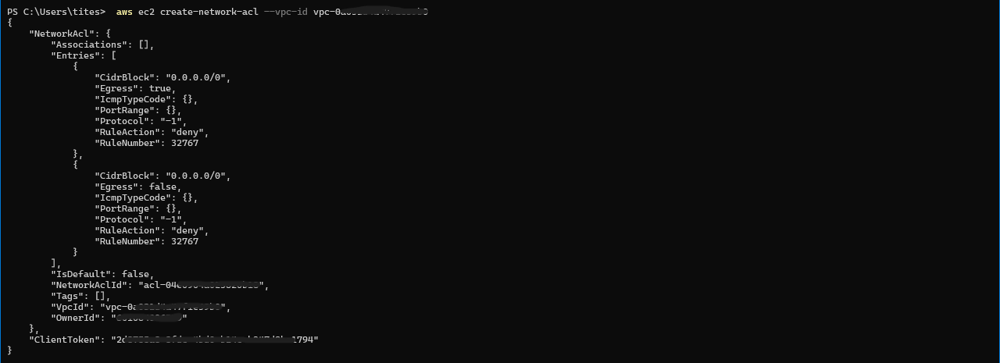  
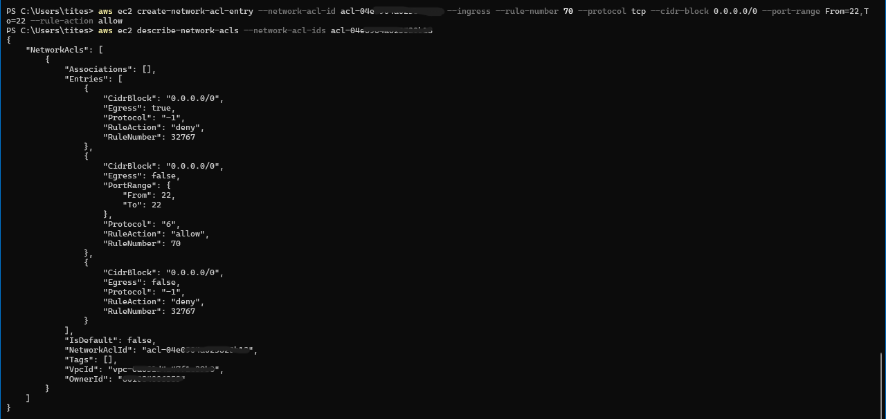

---

### 9. Allocate and Associate Elastic IP

Attached public IP to network interface.

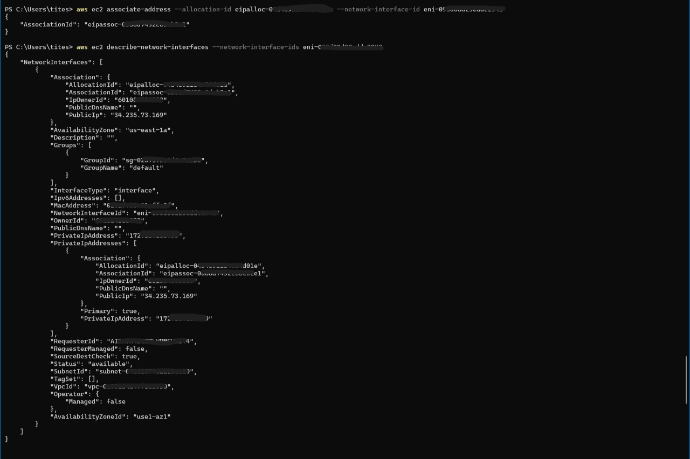

---

### 10. Transit Gateway Routing

Configured and verified routing between VPCs.

**Create / Verify Routes**
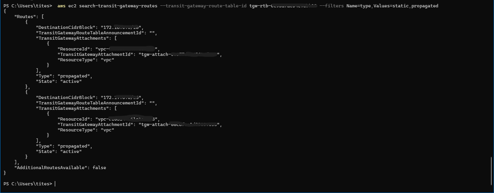

**Propagated Routes**
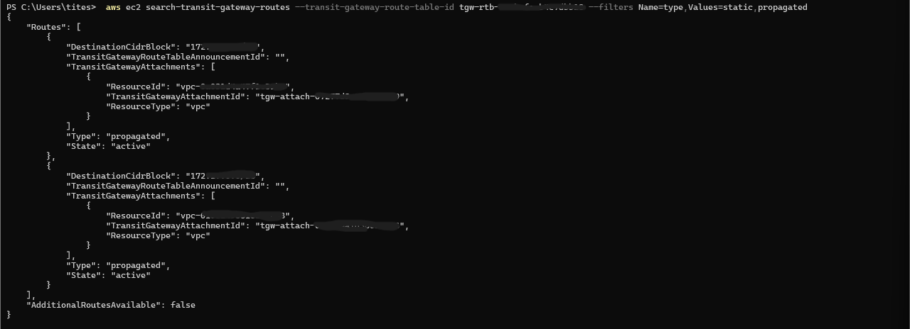

---

### 11. Validate Cross-VPC Routing

Confirmed connectivity between VPCs via TGW.

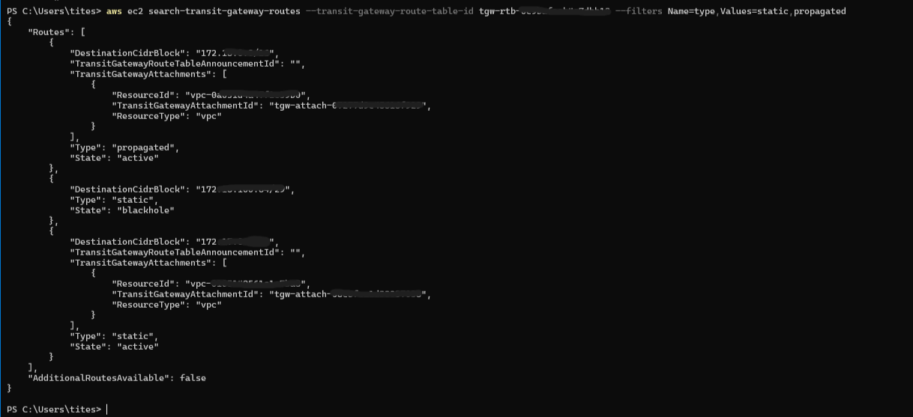

---

### 12. Blackhole Route Test

Created a blackhole route to observe traffic behavior.

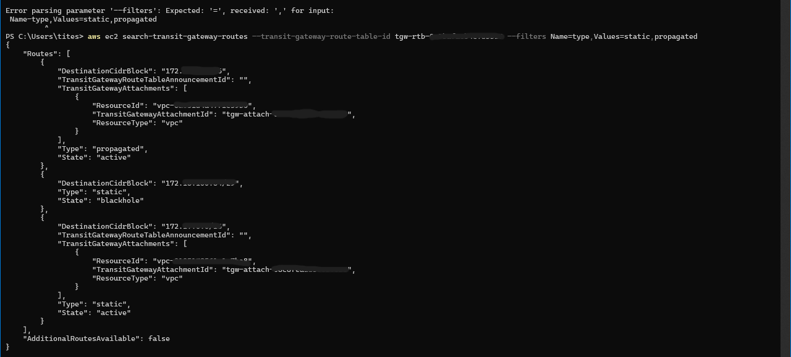

---

## Key Takeaways

- Working through the CLI forces a better understanding of how AWS networking components actually interact  
- Route tables and propagation behavior become much clearer when you build them manually  
- Transit Gateway routing is much easier to understand when you can see the outputs directly  
- Small mistakes (wrong IDs, wrong route tables) are easier to debug when you're not relying on the UI  

---

## Final Thoughts

This project helped reinforce how VPC networking works under the hood, especially when it comes to routing and traffic flow between environments.

It also highlighted how much visibility the CLI gives you compared to the console — especially when troubleshooting.

---
